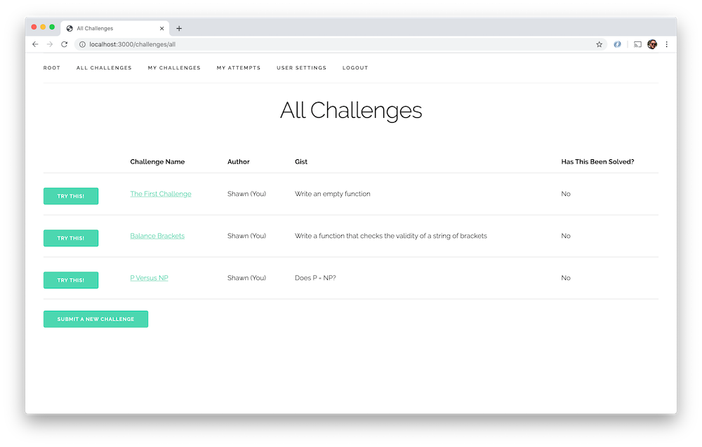

# Code Challenge App

Have you ever asked yourself "Is there a place I can go to attempt some code challenges? Is there also a place where I can submit code challenges for others to try? Hell, is there a place where I can submit a challenge and ALSO submit an attempt at a solution?" Well, probably not to that last one, but you can with this new amazing project! Does this sound like an infomercial? I think it sounds like an infomercial. Screw it; I'm running with it.

This is an ExpressJS app built to satisfy all of your (read "my, the author's") code challenge needs! Does something like this already exist? Yes! Is it better than what I built? Also yes! But, **I** didn't make the other ones, so **I** don't like them quite as much. So there.

Now, for the low, low price of NOTHING (*donations appreciated!*) you can play around with this app, submit code challenges, submit attempts, review submissions and so much more! Now, off to the fine print!

## Technologies Used

Here's a partial list of the technologies used – I'll refrain from extrapolating down to machine code and transistors for the remainder of the technologies:
- NodeJS
- ExpressJS
- MongoDB
- Mongoose
- EJS
- Skeleton CSS
- Atlas
- Heroku
- Markdown
- probably some others I've missed

The data is warehoused in an Atlas-hosted MongoDB and accessed via Mongoose. Hosting provided by Heroku. All views are created using Embedded JavaScript, and Skeleton provides the CSS framework. Oh, and for completeness the README is created using Markdown. I assume you can .

## Getting Started

[Click here](https://unstuck-code-challenges.herokuapp.com/) to view the live app! [This Trello board](https://trello.com/b/uw6JlGMz/code-challenge-app) served as the organizational anchor of this project. 

Unauthorized users can view the complete list of posted challenges. After logging in with your Google account, you will be routed to user preferences where you will need to select whether you will be a coder or a challenger – you must choose one to continue. After this, navigating the app should be pretty self-explanatory. Happy coding!

## Navigation

Upon launching the app, you will arrive at the landing page. Simply log in using your Google account to continue. After logging in, you will be asked to update your user preferences. Depending on your choice, you will be directed to either the Challenger home page or the Coder home page

Upon arriving at the Challenger home page the user can view all of their posted challenges and navigate through this subdirectory.

Similarly, the user will have access to their coding subdirectory if they choose that route.

## Next Steps

Whatever features I don't get to by Monday morning will go here.